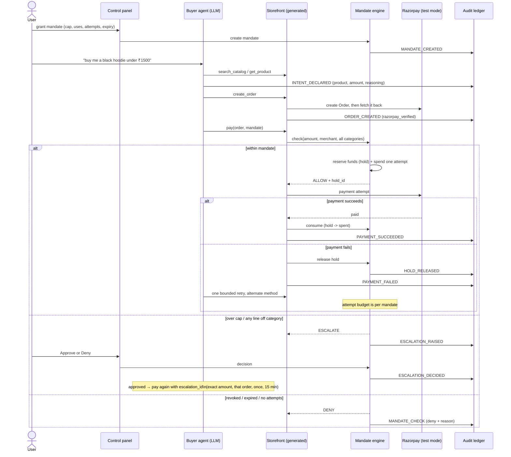

# AgentSetu

**Make any Indian merchant sellable to AI buyers in 5 minutes.**

> Razorpay Buildathon — Track 01: AI Growth & Agentic Commerce

Razorpay's Claude pilot made Zomato, Swiggy, and Zepto agent-transactable — each hand-integrated. AgentSetu is the self-serve version for the other 10 million merchants: paste your catalog, get an agent-readable storefront with Reserve-Pay-style mandates, server-enforced spending gates, and a signed audit trail.

**The design principle:** the LLM decides *what* to buy; deterministic code decides *whether money moves*. An LLM-enforced spending limit is a prompt injection away from failure — a server-side gate is not.

I wrote that sentence, then spent an evening attacking my own gate. Four attacks worked. They are fixed, and `npm test` is the suite that proves it. What broke and what I chose is in **[DECISIONS.md](DECISIONS.md)**.

## The bar, met

The track brief says: *"Every money action explainable, bounded and gated. Show the audit trail and one failure handled gracefully."*

| Requirement | How AgentSetu does it |
|---|---|
| **Explainable** | The agent must call `declare_intent` (product, amount, reasoning) before `pay` — it lands on the ledger before money can move |
| **Bounded** | Mandates carry a cap, category, expiry, use count and an **attempt budget** (modeled on UPI Reserve Pay). Attempts are counted **per mandate, not per order**, so an agent cannot buy fresh retries by opening a new order |
| **Gated** | Every `pay` passes through a **separate mandate-engine process**. Over-cap or off-category → human approve/deny escalation. The LLM literally cannot bypass it. Paying with no mandate at all gets an **HTTP 402 challenge** |
| **Audit trail** | Append-only, **HMAC-signed** hash chain with the head **anchored out of band**. It survives a re-chained forgery and a truncation, not just a careless edit. The panel verifies it live |
| **Failure handled** | Deterministic forced decline (`test_card_declined`) → the reserved money is **released back to the mandate** → agent consults retry policy → one bounded retry with an alternate method → recovery, all on the ledger |

## The gate, in order

Every single payment passes these, in this sequence, in a process the model cannot reach:

1. mandate exists and is ACTIVE (not revoked, expired, exhausted)
2. mandate belongs to this merchant
3. attempt budget not exhausted — bounded across every order, not per order
4. **every** line item's category is inside the mandate's category
5. amount fits inside `cap - spent - held`, where `held` is money reserved by an in-flight payment

1, 2 and 3 are hard denies. 4 and 5 escalate to a human. Every outcome is a ledger event.

## Architecture


The agent can search, compare and create orders all day. Only one call moves money, and that call leaves the model's world entirely: it goes to a separate process that answers ALLOW, ESCALATE or DENY, and reserves the funds before the payment is attempted.

## Purchase workflow



## Quick start

```bash
npm install
cp .env.example .env        # add your LLM key; Razorpay keys optional
npm run generate -- data/sample-catalog.csv "Arjun Apparel"   # merchant onboarding
npm run dev                 # mandate-engine :4001 · storefront :4100 · panel :3000
```

Open **http://localhost:3000**, grant a mandate, then in another terminal:

```bash
# LLM agent (uses LLM_BASE_URL / LLM_MODEL from .env — any OpenAI-compatible endpoint)
npm run agent -- --task "buy me a black hoodie under 1500 rupees" --auto-mandate 1500

# Deterministic scripted demos (no LLM key needed)
npm run demo:scripted -- happy      # in-mandate purchase
npm run demo:scripted -- escalate   # over-cap -> human approve/deny in the panel
npm run demo:scripted -- failure    # forced decline -> hold released -> bounded retry
npm run demo:scripted -- attack     # the four attacks the gate is built to stop

# The suite that keeps the README honest (no keys, no network)
npm test
```

## Is it really talking to Razorpay?

Orders are real. With `RAZORPAY_KEY_ID`/`RAZORPAY_KEY_SECRET` in `.env`, `create_order` calls the live test-mode Orders API and then **fetches the order back**, so the ledger records Razorpay's view of it (`razorpay_verified: true`). Match ledger order ids against your dashboard.

The **capture leg is simulated**, deliberately and visibly (`capture: "simulated"` in the manifest, on every payment event, and in the panel). Razorpay has no server-side charge API: a real capture needs a human at Checkout with a test card, which is exactly what an autonomous agent cannot drive. Simulating it also makes the failure demo reproducible with no keys at all. Full reasoning in [DECISIONS.md](DECISIONS.md).

## Protocol surfaces

The track's "why now" is UAP, ACP, AP2 and x402. The same tools are exposed three ways:

| Surface | Endpoint | Shape |
|---|---|---|
| HTTP tools | `POST /tools/:name` | `agentsetu-tools/1`, discovered at `GET /manifest` |
| MCP | `POST /mcp` | JSON-RPC 2.0: `initialize`, `tools/list`, `tools/call` |
| Payment challenge | `pay` without a mandate | x402-style **HTTP 402** naming the authorization required |
| Mandate | `GET /mandates/:id/ap2` | AP2-shaped signed PaymentMandate: constrained, expiring, revocable |

```bash
curl -s localhost:4100/mcp -H 'content-type: application/json' \
  -d '{"jsonrpc":"2.0","id":1,"method":"tools/list"}' | jq '.result.tools[].name'
```

## Demo flows

1. **Happy path** — mandate ₹1500 → agent searches, compares, declares intent, pays ₹1299 via `upi_reserve_pay`. Watch the meter fill on the mandate card.
2. **The gate** — agent tries the ₹2799 premium hoodie under a ₹1500 mandate → `ESCALATE` → the panel shows the agent's own reasoning → human approves (payment proceeds once, exact amount, that order) or denies (agent stands down).
3. **Graceful failure** — forced `issuer_declined` → the hold is released so the budget is whole again → retry policy consults attempts left → one retry via alternate method → success. The whole chain is signed on the ledger.
4. **Kill switch** — revoke the mandate mid-session; the agent's next pay is denied with the reason on the ledger.
5. **The attacks** — `npm run demo:scripted -- attack` runs four things a hijacked agent would try, live, and shows each refusal landing on the ledger.

## Repo map

```
src/mandate/     the money gate: mandates, holds, escalations, signed ledger
src/storefront/  onboarding generator + generated merchant tool server (HTTP, MCP, 402)
src/agent/       LLM buyer agent + scripted deterministic demos
src/panel/       live control panel (mandates · escalations · audit trail)
test/attacks.mjs 17 attacks on the gate and the ledger — npm test
data/            sample merchant catalog (CSV)
DECISIONS.md     what broke, what I chose, what I would not fake
```

## Security notes

- No API keys in the repo — `.env` and `runtime/` are gitignored; rotate any key that ever leaks.
- The mandate check, spend accounting, funds holds and attempt limits are all server-side, in a process the model cannot reach.
- An approved escalation authorizes **one payment of the exact escalated amount, for that order, within 15 minutes**. It cannot be reused or stretched.
- The ledger is HMAC-signed with a key held outside the ledger file (`LEDGER_SECRET`), and the head is anchored separately. It detects edits, forgeries and truncations. It does not defend against an attacker who owns the machine and reads the key — see [DECISIONS.md](DECISIONS.md) for the real threat model.
